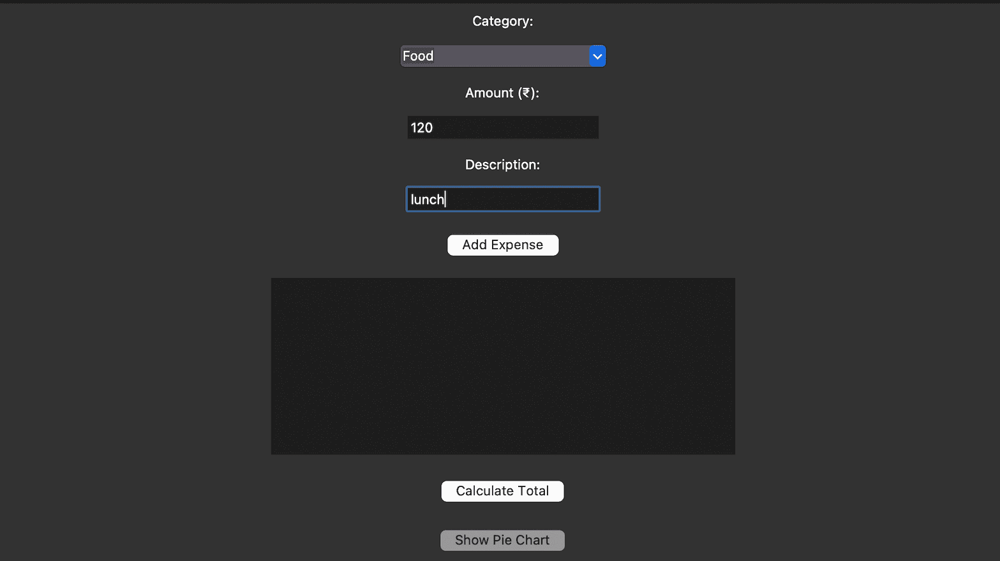
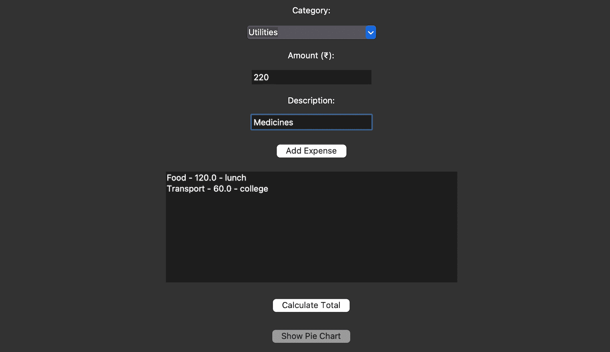
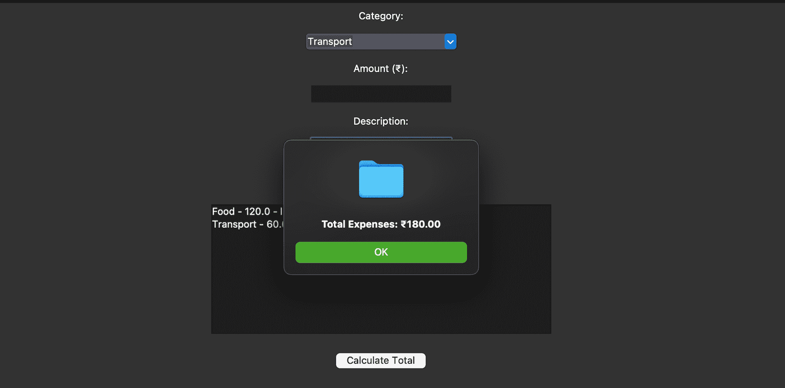
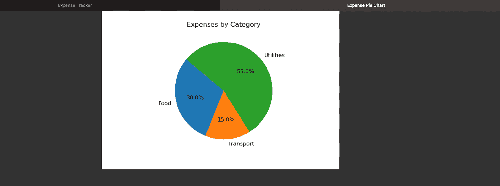

# Expense Tracker

## Description
This is a simple **Expense Tracker** application built using **Python** and **Tkinter**. The app allows users to:
- Add expenses with a category, amount, and description.
- View a list of all added expenses.
- Calculate the total expenses.
- Visualize expenses by category using a pie chart.

## Features
- Add, view, and calculate expenses.
- Display a pie chart for expense breakdown by category.
- Intuitive and simple GUI using Tkinter.
- Predefined categories (e.g., Food, Transport, Utilities, Others).

## Prerequisites
To run this project, you need:
- Python installed on your system.
- **Tkinter** (pre-installed with Python).
- **Matplotlib** for pie charts (install using `pip install matplotlib`).

## Screenshots
Here are the screenshots of the Simple GUI Calculator:

### Screenshot 1:


### Screenshot 2:


### Screenshot 3:


### Screenshot 4:


## How to Run the Project
1. Clone the repository:
   ```bash
   git clone https://github.com/RachitTyagi17/Expense_Tracker.git